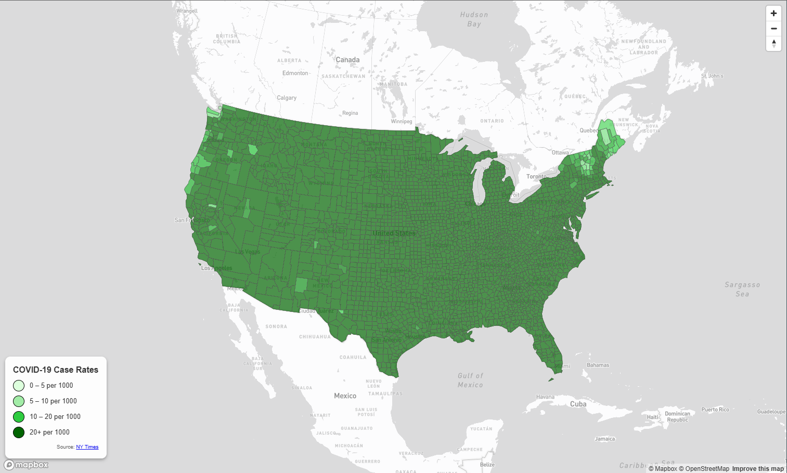
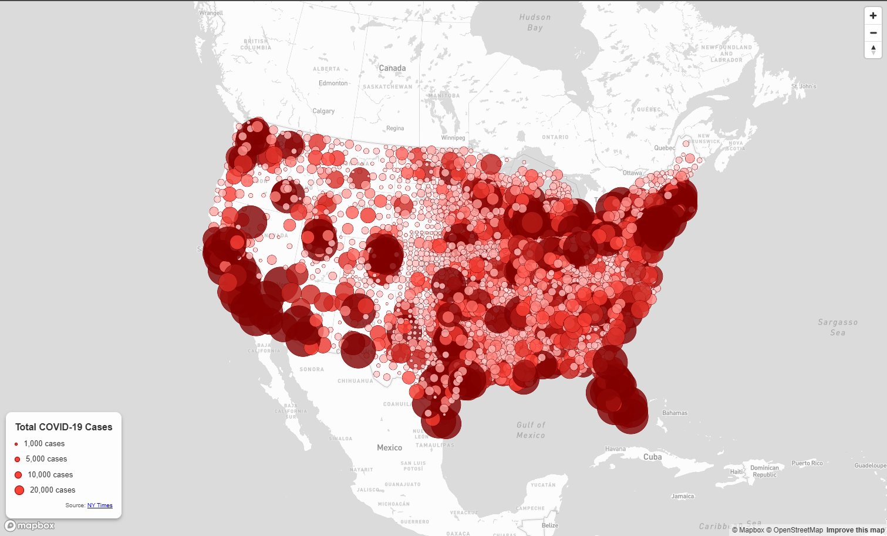

# COVID-19 Cases and Rates in the United States (2020)

## Introduction

This project presents two interactive web-based thematic maps that visualize the spatial distribution of COVID-19 impacts across counties in the United States for the year 2020. The maps are developed using Mapbox GL JS and are designed to demonstrate best practices in web cartography, including appropriate data preprocessing, thematic representation, interactivity, and deployment via GitHub Pages.

The project consists of two complementary maps:

1. A proportional symbol map displaying total confirmed COVID-19 case counts by county.
2. A choropleth map displaying COVID-19 case rates (cases per 1,000 residents) by county.

Both maps use the Albers Equal Area projection, which is appropriate for national-scale mapping of the United States.

---

## Maps

The maps can be accessed using the following URLs:

- **Choropleth Map – COVID-19 Case Rates**  
  https://Malika1214.github.io/us-covid-2020-maps/map1.html

- **Proportional Symbol Map – COVID-19 Total Cases**  
  https://Malika1214.github.io/us-covid-2020-maps/map2.html

---

## Data Sources

The datasets used in this project come from the following sources:

- COVID-19 case and death data: The New York Times (county-level, 2020)
- Population data: 2018 American Community Survey (ACS) 5-Year Estimates
- County boundary geometries: U.S. Census Bureau

The COVID-19 case rate was calculated using the following formula:

case rate = (total cases / county population) × 1000

All datasets were processed specifically for this project to ensure efficient rendering and correct thematic mapping in a web environment.

---

## Data Processing

Before visualization, the original shapefiles were processed using GIS and web-mapping tools:

- Shapefiles were converted to GeoJSON format
- All unused or irrelevant attributes were removed
- County geometries were simplified using mapshaper to reduce file size
- Data were verified to ensure compatibility with Mapbox GL JS
- Case rate values were calculated and stored as numeric attributes

For the proportional symbol map, county centroids were used to represent total case counts. For the choropleth map, full county polygon geometries were retained.

---

## Map Design and Functionality

Both maps share the following design and functional characteristics:

- Albers Equal Area projection
- Mapbox Light basemap for visual clarity
- Appropriate initial zoom level and center for the continental United States
- Interactive popups displaying county name, state, and attribute values
- Custom legends explaining symbol sizes or color classes
- Navigation controls for zooming and panning
- Responsive layout suitable for different screen sizes

The choropleth map uses a graduated color scheme to represent COVID-19 case rates, while the proportional symbol map uses circle sizes scaled by total case counts.

---

## Libraries and Technologies

The following libraries and technologies were used in this project:

- Mapbox GL JS
- JavaScript (ES6)
- HTML5
- CSS3
- mapshaper (for data simplification and processing)

---

## Project Structure

The repository is organized as follows:

us-covid-2020-maps

│ map1.html

│ map2.html

│ readme.md

├─assets

│ us-covid-2020-counts.geojson

│ us-covid-2020-rates.geojson

├─css

│ styles.css

├─img

│ map1_screenshot.png

│ map2_screenshot.png

└─js

  main.js

---

## Screenshots

Screenshots of both maps are included in the `img` directory:

- Choropleth map showing COVID-19 case rates by county

- Proportional symbol map showing total COVID-19 cases by county

These images provide a visual overview of the project and its primary cartographic outputs.

---

## Credits and Acknowledgments

- The New York Times for providing COVID-19 case and death data
- U.S. Census Bureau for county boundary and population data
- Mapbox for basemap services and web mapping framework
- Course instructors and materials for guidance on web and mobile GIS techniques

---

## Author

Malika Ali  
GEOG 458 A Wi 26: Advanced Digital Geographies – Lab 3
Academic project created for educational purposes.

---

## License

This project is intended for academic use only. All data sources remain the property of their respective owners.

